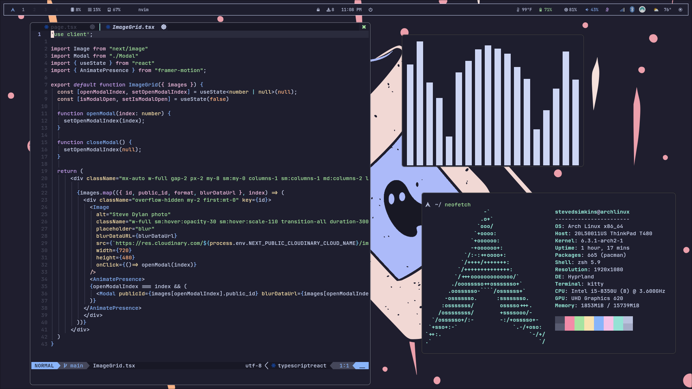

<h1 style="text-align: center;">Catppuccin Hyprland</h1>



# Getting Started
If you want to give this a go be sure to have Hyprland already installed and any other of the apps I listed below. Then just follow these steps:

1. Clone this repo
```
git clone https://github.com/stevedylandev/dotfiles
```

2. Now copy the files to your `.config` directory using this command
```
cp -r dotfiles/.config/* ~/.config/
```

3. That's it! You will likely need to reboot your machine for all the config changes to take place. I personally love doing it through the simple ```reboot``` command from the terminal!

# What I Use
**Color Scheme** - [Catppuccin](https://github.com/catppuccin/catppuccin)

**Operating System** - [Arch Linux](https://archlinux.org)

**Window Manager** - [Hyprland](https://hyprland.org)

**Status Bar** - [Waybar](https://github.com/Alexays/Waybar)

**Terminal** - [Alacritty](https://github.com/alacritty/alacritty)

**Text Editor** - [NeoVim](https://neovim.io)

**Audio Visualizer** - [CAVA](https://github.com/karlstav/cava)
